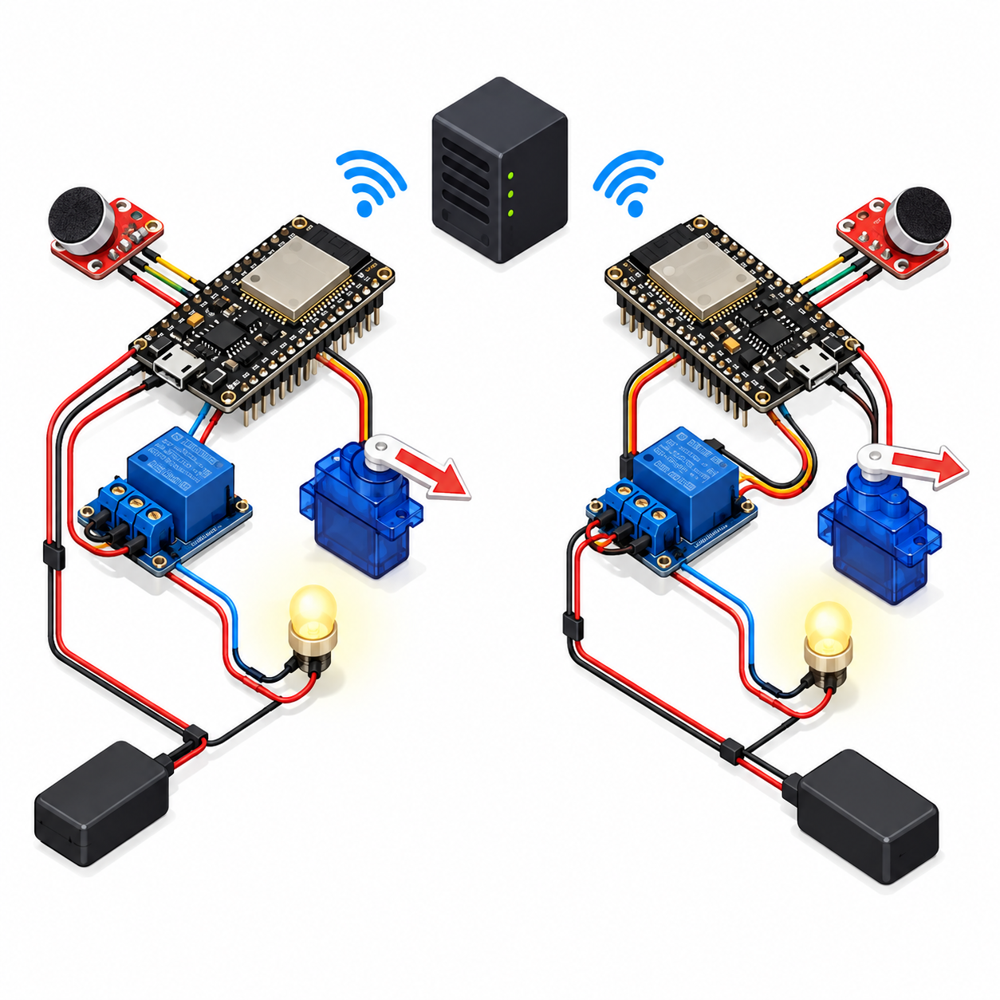

# Smart Entryway Multi-Room Network
Two ESP32 nodes use analog microphones to detect sound activity and coordinate demonstration lamps and loose servo pointers through Home Assistant over Wi-Fi. The microphones do not record audio or recognize speech.



## Overview, objectives and features
Learn per-node sensing, encrypted native API, multi-room coordination and bounded outputs. Sound at either healthy node requests both indicators. Each node independently enforces a five-second pulse, boot-off and sensor/network fail-off. Retriggers restart the local timer.

## Architecture and platform
ESP32 DevKit esp32dev, ESPHome 2026.9.1 with ESP-IDF, Home Assistant and a Wi-Fi access point. [Shared firmware](firmware/device.yaml) serves [node A](firmware/node-a.yaml) and [node B](firmware/node-b.yaml), with unique names. [Architecture](docs/architecture.md), [HA automation](config/home-assistant-automation.yaml) and [editable circuit](docs/circuit-diagram.svg) describe the same design.

## Bill of materials (two nodes)
| Quantity | Item |
|---:|---|
| 2 each | ESP32 DevKit and USB data/power cable |
| 2 | 3.3V analog microphone module with biased output |
| 2 | Active-high 3.3V-compatible relay module, 5V coil |
| 2 | Micro servo accepting 3.3V PWM, with loose pointer |
| 2 each | Small 5V LED lamp, external 5V ≥1A supply, 1A fuse |
| 2 | 10kΩ relay-input pulldown |
| 2 each | Breadboard and jumper set |
| 1 each | Wi-Fi access point and Home Assistant host |

## Prerequisites and exact pin map
Python 3.12, ESPHome 2026.9.1, HA ESPHome integration, and USB drivers. Verify microphone bias, component polarity and voltage limits. Both nodes use identical pins:
| ESP32 pin | Connection |
|---|---|
| GPIO34 / ADC1 | Microphone OUT, ≤3.3V |
| GPIO25 | Relay IN and 10kΩ to GND |
| GPIO26 | Servo signal, 50Hz |
| 3V3 | Microphone VCC |
| GND | All component and external supply negatives |
| External fused 5V | Relay VCC/COM and servo V+ |
| Relay NO | Lamp positive; NC unused |

## Circuit, wiring and assembly
Disconnect power and follow [the circuit](docs/circuit-diagram.svg) and [wiring guide](docs/wiring.md). Join negatives; keep external positive off 3V3. Controllers use USB power. Use small 5V lamps only. Fit no door or lock linkage. Remove the servo arm while calibrating pulse endpoints. Give the two boards unique names to avoid discovery collisions.

## Setup and flashing
```sh
python -m pip install esphome==2026.9.1
cp firmware/secrets.example.yaml firmware/secrets.yaml
# Replace the dummy Wi-Fi settings and CI key privately.
esphome config firmware/node-a.yaml
esphome compile firmware/node-a.yaml
esphome run firmware/node-a.yaml
esphome run firmware/node-b.yaml
```
Choose each board’s USB port. Generate a private 32-byte API key with `openssl rand -base64 32`; keep it in ignored secrets.yaml and enter it when adding both devices to HA. The public non-zero example key is a CI dummy and must not be deployed. For distinct keys per node, maintain separate private configuration directories. Flash by USB first; use authorized network access for subsequent ESPHome OTA.

## Configuration
Defaults: ADC sample interval 10ms, one-second windows, at least 20 valid samples, sound threshold 0.25V peak-to-peak, clipping at ≤0.03V or ≥3.25V, and five-second pulses. These are uncalibrated demonstration values. Servo PWM is 50Hz with 1–2ms endpoints; rest is -100% (1ms), active is 0% (1.5ms). Actual angles depend on the servo. Verify travel before attaching the loose pointer.

## Usage and multi-room coordination
Add both devices in HA and verify their actual entity IDs. Merge [the automation](config/home-assistant-automation.yaml), adjust IDs to discovered names, and reload automations. Either Sound Activity OFF→ON edge triggers both switches only when both Sensor OK entities are ON. Sustained sound does not create repeated edges; quiet then loud can retrigger. A manual Indicator ON is accepted only with a valid sensor and native API connection. OFF cancels the pulse. Faults or API/Wi-Fi disconnection independently rest each node, even without HA coordination.

## Telemetry/data formats and expected output
Native API exposes Sound Peak in volts, Sound Activity, Sensor OK, and Indicator state. [Sample JSONL](sample-data/telemetry.jsonl) illustrates those values; the actual API uses protobuf, not JSONL. Invalid peaks are unavailable/NaN, sound becomes false and outputs rest. After a short loud sound with both nodes healthy, HA requests both indicators; each rests after five seconds. There is no OLED in this project. Cross-node latency and ordering are not guaranteed.

## Actual run tests
[Run results](docs/validation-results.md) record C++ tests for window count, peaks, quiet input, clipping, NaN and recovery; three image tests; PNG/SVG/link/MIT/credential checks; HA YAML syntax; and actual ESPHome configuration plus ESP-IDF builds for both node names. [Hardware test plan](docs/test-plan.md). Physical microphones, relay/servo behavior, live API, HA automation and Wi-Fi coordination have not been tested.

## Troubleshooting
Unavailable API: check private key, SSID, unique names and network access. No sound event: inspect microphone bias, threshold and Sensor OK. One indicator: verify actual HA entity IDs, both Sensor OK states and API connections. Servo jitter: inspect supply current, ground and pulse calibration. An active-low relay is incompatible with this circuit.

## Limitations and domain safety
Sound activity cannot identify people or understand speech. The 100Hz sampling can alias audio and is a crude sound-event detector, not an audio meter. False events and network delays are possible; there is no synchronized clock or certified safety guarantee. Relays drive low-voltage lamps and servos move loose pointers only. Do not connect mains, locks, egress equipment or other critical loads. GPIO is 3.3V; coil and servo power are external. Keep fused supplies, wires and moving pointers away from pinch points.

## Future work
Measure latency and false positives, add hardware-in-loop fault tests, and validate authenticated control policies on real nodes.

## Contributing and license
Maintain fault coverage, independent output bounds and pin-map consistency. Full [MIT license](LICENSE). Primary documentation: [native API](https://esphome.io/components/api/) and [servo](https://esphome.io/components/servo/).
